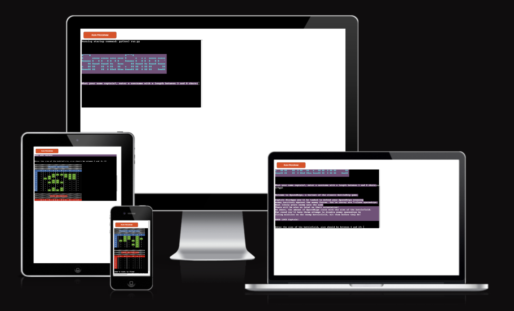
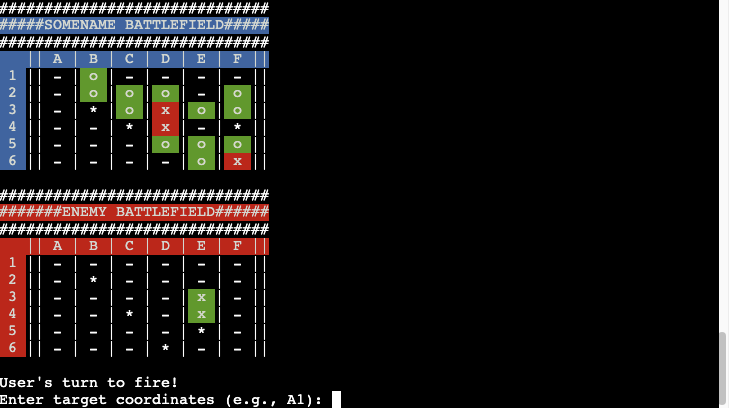
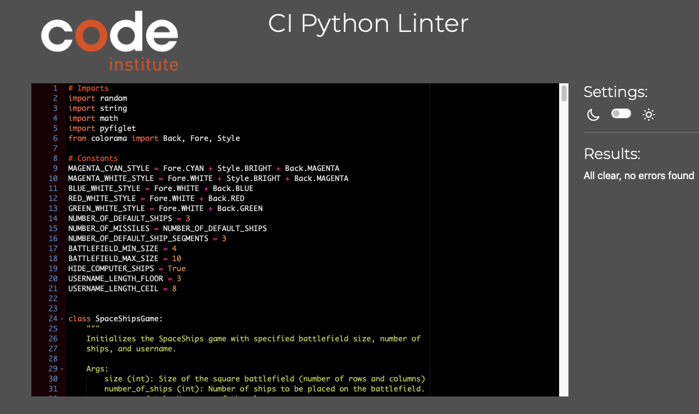
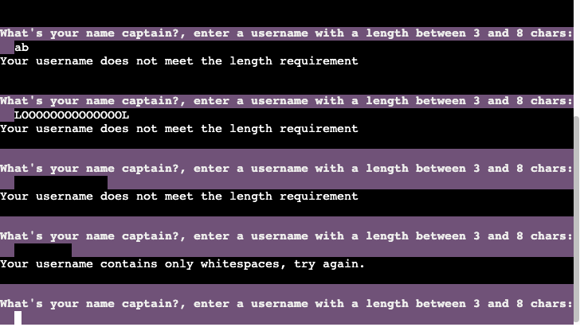
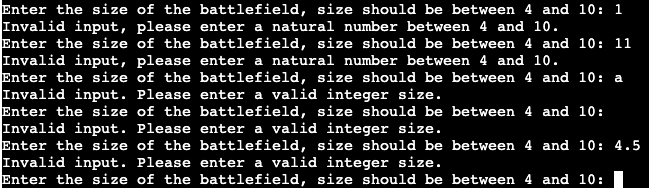
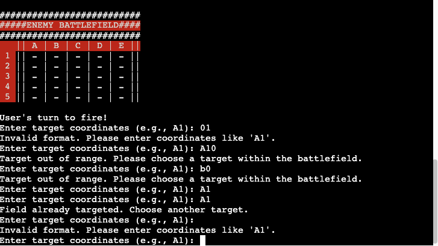
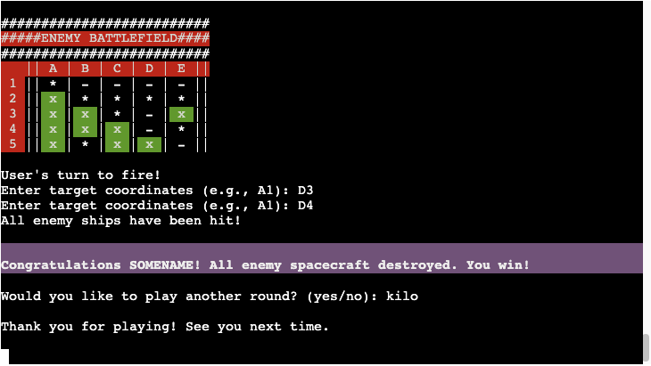

# SpaceShips Game

## Introduction
SpaceShips is a variant of the classic "Battleship" game where players aim to destroy enemy ships by guessing their locations. The objective is to defend spaceships while attempting to disable enemy ships by firing missiles.
<br>
While in the *classic* variant it would be a tedious singlehit vs singlehit battle, this time you have up to three shots per turn. This brings much more pace to the game, so make every hit count!
<br>
As the task was to create an application that is purely run from the console and the use from the pygame lib is not allowed my goal was to create a user experience that goes beyond a *simple* black-and-white console application.



## Table of Contents

- [Introduction](#introduction)
- [Technologies and Libraries Used](#technologies-and-libraries-used)
  - [Python Standard Libraries](#python-standard-libraries)
  - [External Libraries](#external-libraries)
  - [Extentions used in VSCode](#extensiones-used-in-vscode)
- [Key Features and Algorithms](#key-features-and-algorithms)
- [Project Structure](#project-structure)
- [Unique Aspects to Highlight](#unique-aspects-to-highlight)
  -[Intuitive Coloring](#intuitive-coloring)
- [Testing & Validations](#testing--validations)
  - [Semiautomatic Testing](#validations)
  - [Manual Testing Validations](#manual-testing)
- [Credits](#credits)

## Technologies and Libraries Used
### Python Standard Libraries
- `random`: For generating random numbers (ship placement, computer's moves).
- `string`: Handling strings, particularly for battlefield coordinates.
- `math`: Used for mathematical operations in print formatting.

### External Libraries
- `pyfiglet`: Creating ASCII art titles.
- `colorama`: Adding color and styles to the console output.

### Extensiones used in VSCode
- `pylint`: Linting code relevant errors.
- `ruff`:   Formatting code on save event.
- `settings.json` from VScode
```json
{
    "python.analysis.autoImportCompletions": true,
    "python.analysis.typeCheckingMode": "basic",
    "pylint.args": ["--max-line-length", "79"],
    "ruff.format.args": ["--line-length", "79"],
    "ruff.fixAll": true,
    "[python]": {
        "editor.formatOnSave": true,
        "editor.rulers": [79],
    }
}
```

## Key Features and Algorithms
- **SpaceShip Class**: Manages the game state, including battlefield setup, ship placement, and turn management.
- **Ship Placement Algorithm**: Places 'L'-shaped ships randomly, ensuring they fit and don't overlap.
- **Missile Firing Logic**: Marks hits or misses on the battlefield.
- **User Input Validation**: Ensures valid targeting and username creation inputs.
- **Turn-Based Gameplay**: Alternates turns between the user and the computer.

## Project Structure
- **Constants and Styles**: Defined for easy modification (number of ships, color styles).
- **Class `SpaceShipsGame`**: Core of the game with methods for gameplay.
- **Utility Functions**: `get_valid_username`, `get_valid_game_size`, `display_rules` for game setup.
- **Main Function**: Orchestrates game setup and play loop.

## Unique Aspects to Highlight
- **ASCII Art and Colorful Console Output**: Enhances the user experience.
- **Adaptive Game Size and Number of Ships**: Dynamically adjusts based on battlefield size.
- **Customizable Styles**: Uses `colorama` for easy aesthetic customization.

### Intuitive coloring
<div>The battlefields of user and enemy are colored differently. Even without reading what battlefield is yours, you'll notice instantly the <i>friendly</i> <ul><li><span style="background: Cyan; color: black">Cyan</span> coloring for your index and name</li><li><span style="background: Green; color: white">Green</span> coloring for you're placed SpaceShips. And also for your hits on the enemy grid.</li></ul> 
</div>
<div>
Your enemy will be colored in <i>classic</i>
<ul><li><span style="background: Red; color: white">Red</span> coloring for the enemy index as well as when the enemy hits one of your SpaceShips</li></ul>
</div>

<div>
<br>
After each turn a summary is displayed, just above the updated battlefields, for small battlefield it can instantly be seen, when playing a bigger battlefield scrolling upwards is necesarry.
<ul><li><span style="background: Magenta; color: white">Magenta</span> is the color that highlights important information througout the game</li></ul>

</div>


## Testing & Validations
### Validations
1. [CI Python Linter](https://pep8ci.herokuapp.com)
    - For this project it was mandatory to check for code errors with
    - **Result:** All clear, no errors found.
    
2. **Snyk** did not find any issues on the *Code Analysis* Section.

### Manual Testing Validations
The project was manually tested for each feature that expects an input to return the expected behaviour. 
As Browsers mainly *Google Chrome* was used for testing, as on *Safari* within MacOS the displayed terminal application wont run properly.

#### Feature - Username input:
- **Rule:** Username should be between 3 and 8 chars, it can also contain numbers and whitespaces.
- An error will be shown when the length is not correct.
- An error will be shown when the name contains only whitespaces


#### Feature - Size of battlefield
- **Rule:** Battlefield size should be between 4 and 10
- An error will be shown when the size is not inside the given interval.
- An error will be shown when the input is not a number.
- An error will be shown when the input is not an natural number (integer).


#### Feature - Coordinate input
- **Rule:** Input must be of the type 'Alphanumerical'. First char must be a letter that is displayed in the index of the battlefield. The following number has to be a number from the displayed index of the battlefield.
- An error will be shown when the input type is wrong.
- An error will be shown when the input is out of bounds.
- An error will be shown when the coordinate was already entered.


#### Feature - New game
- **Rule:** Any other input than 'yes' will quit the game.



## Deployment
### Heroku 
For deployment it is needed to add two buildpacks from the _Settings_ tab.

    1. `heroku/python`
    2. `heroku/nodejs`
    __________________
    For deployment it is also needed to create the _Config Var_ called `PORT`. Set this to `8000`
    __________________
    For this repository, no credentials were used so far, in case thouse will be added in the future it is necesarry to create in Heroku a _Config Var_ called `CREDS` and paste the JSON into the value field.
    __________________
    After e.g. the GitHub repository was connected and the correct repo was chosen it can be deployed as normal.

### Local

Python3 needs to be already installed for this project to run correctly,
e.g. on Mac:
```code
brew install python3
```
In a terminal navigated in the root directory of this project type in and enter.
```code
python3 run.py
```


## Constraints

The deployment terminal is set to 80 columns by 24 rows. That means that each line of text needs to be 80 characters or less otherwise it will be wrapped onto a second line.

## Credits

- **The deployment** process was taken from the template linked in this github-repo.

- **Figlet** were used for Creating ASCII art titles [click here fore examples on figlet.org](http://www.figlet.org/examples.html)

- **Pyfiglet** for easier figlet integration - "pyfiglet" import was used, find more information on [geeksforgeeks.org](https://www.geeksforgeeks.org/python-ascii-art-using-pyfiglet-module/)
- **Colorama** for bringing more than black and white to the console, have a look at [geeksforgeeks.org](https://www.geeksforgeeks.org/print-colors-python-terminal/)
- **ui.dev** for the responsive mock for this documentation, try it on [ui.dev/amiresponsive?](https://ui.dev/amiresponsive?)
- **convertio.co** for convertation of .jpegs to .webp format [convertio.co/](https://convertio.co/en/jpeg-webp/)
